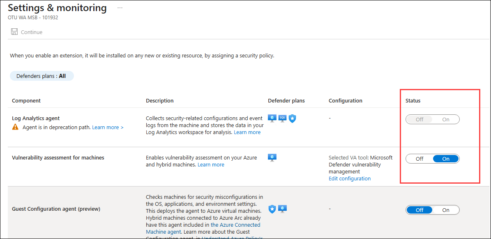

# Exercise 1: Getting Started with the Environment

## Overview

In this module, you will learn how to enable Microsoft Defender for Cloud in your subscription

## Objectives

You will be performing the following activities to achieve the goal:

  - Task 1: Enabling Microsoft Defender for Cloud
  - Task 2: Creating Microsoft Defender for Cloud Default Policy

## Task 1: Enabling Microsoft Defender for Cloud

In this task, you will be getting started with the functionality of Microsoft Defender for Cloud and how to enable Microsoft Defender for Cloud on a subscription.

### Subscription upgrade and agent installation

1. Type **Microsoft Defender for Cloud** in the search box on top of the **Azure Portal** and click to open it.

    

1. Go to the **Microsoft Defender for Cloud** page, Under **Management (1)**  click on the **Environment settings (2)** page, and select your **Azure subscription (3)**.

    
    
1. Once all the configurations are turn **On (1)**, click on **Save (2)**. 

    

    

1. From the **Settings | Defender Plans** page, navigate to **Settings & monitoring**.

    

1. On the **Settings & monitoring** tab, review the status of **Log Analytics agent**

    

1. In the **Microsoft Defender for Cloud** page, expand **Management (1)** from the left navigation pane and select **Environment settings (2)**. On the Environment settings page, expand **Azure (3)** to view the available subscriptions, then expand your assigned **subscription (4)**. Finally, select the **asclab-la-xxxxx** Log Analytics workspace **(5)** to open its settings and continue with the configuration.

    

1. On the **Defender plans** page, select **Defender plans (1)**, click **Enable all plans (2)**, and then click **Save (3)**.

    

 

> Please notice:
> * To get the full functionality of Microsoft Defender for Cloud, both the subscription and Log Analytics workspace should be enabled for Defender. Once you enable it,  the required Log Analytics solutions will be added to the workspace.
> * Before clicking on the Upgrade button, you can review the total number of resources you are going to enable on Microsoft Defender for Cloud.
> * You can enable the Microsoft Defender for Cloud trial for 30 days on a subscription-only basis if it has not previously been used.

## Task 2: Creating Microsoft Defender for Cloud Default Policy

In this task, you will create the Microsoft Defender for Cloud default policy in the security policy under Microsoft Defender for Cloud.

1. From the Azure Portal, search for **Microsoft Defender for Cloud (1)** and select **Microsoft Defender for Cloud (2)**.

    
   
1. Go to the **Microsoft Defender for Cloud** page, Under **Management (1)**  click on the **Environment settings (2)** page, and select your **Azure subscription (3)**.

    
   
1. Click on **Security policies (1)** under Settings You'll notice that **Microsoft cloud security benchmark (2)** has been created automatically. Explore the policy by clicking on the policy.

    
   
   > **Note**: Verify that the Toggle button status for the Microsoft cloud security benchmark is set to **On**. If the status option isn't visible, try zooming out in your browser.
   
## Summary

In this lab, you:

- Enabled **Microsoft Defender for Cloud** for your Azure subscription.
- Configured and reviewed **Environment Settings** for Defender for Cloud.
- Verified the status of the **Log Analytics Agent** and monitoring configuration.
- Enabled all available **Microsoft Defender Plans** for enhanced protection and threat detection.
- Explored the relationship between Defender for Cloud and **Log Analytics Workspaces**.
- Reviewed the automatically created **Microsoft cloud security benchmark** policy.
- Verified that the default security policy was enabled and applied to the subscription.
- Learned how Microsoft Defender for Cloud provides security posture management, continuous assessment, and protection across Azure resources.

## Click Next to continue to the next lab.

   